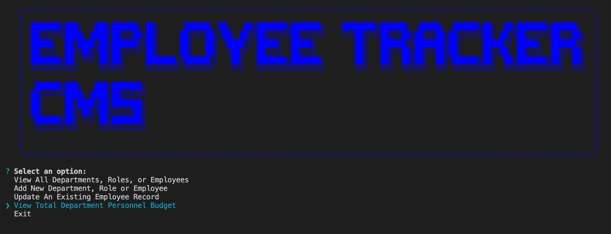
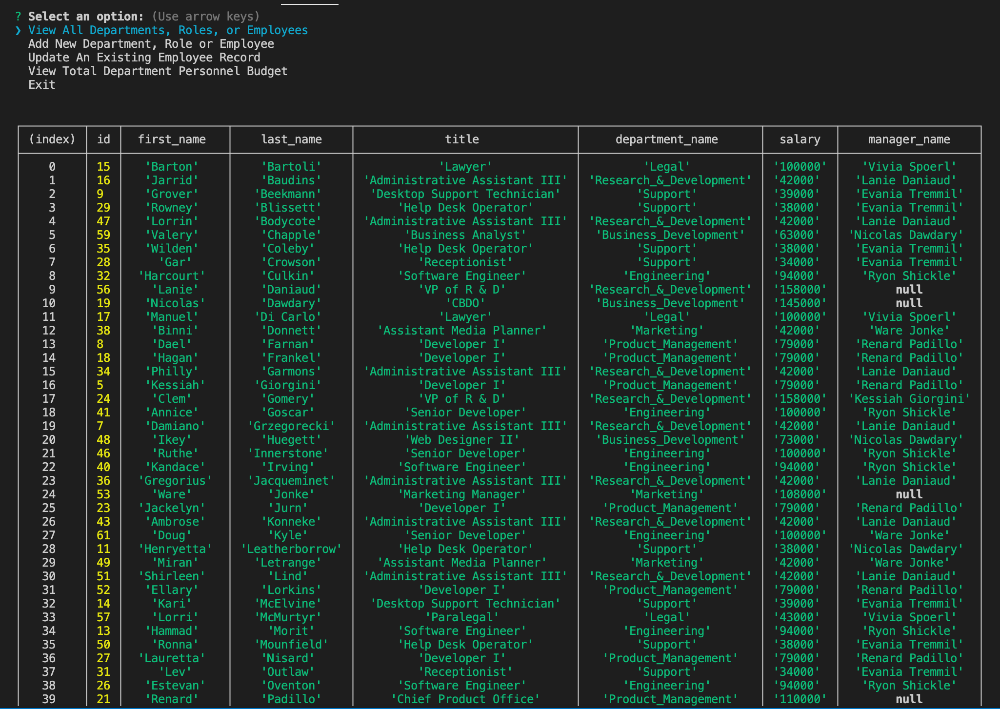

# Employee Tracker CMS

## Table of Contents
* [Description](#description)
* [Prompt Structure](#prompt-structure)
* [Database Schema](#database-schema)
* [Screenshots](#screenshot)
* [Installation](#installation)
* [Usage](#usage)
* [Link](#link)
* [Code](#code)
* [Contact](#contact)
* [Technologies](#technologies)
* [Project Status](#project-status)

## Description 
This is a Node.js command-line application that interfaces with a basic employee management database to manage department, role, and employee records.

## Screenshots



## Prompt Structure
    * View All
        - view all departments
        - view all roles
        - view all employees
    * Add New
        - add a department
        - add a role
        - add an employee
    * Update Existing Employee Record
	    - update role and manager
    * View Total Department Personnel Budget
        - select department


## Database Schema
(employee_tracker_db)

	• department
	    ◦ id
	    ◦ name

	• role
	    ◦ id
	    ◦ title
	    ◦ salary
	    ◦ department_id

	•	employee
	    ◦ id
	    ◦ first_name
	    ◦ last_name
	    ◦ role_id
	    ◦ manager_id


## Installation
Install npm dependencies:
```bash
npm install
```
Load database schema:
```bash
mysql -u root
source db/schema.sql;
```

Optional - Load seed data:
```bash
source db/seeds.sql;
```


## Usage
The application can be invoked with the following command:
```bash
node index.js
```


## Link
[Video Walkthrough](https://drive.google.com/drive/folders/17AvkjUoSTC1Nji76Mpb2CnqLLxsnVDh5?usp=sharing)


## Code
[GitHub Code Repository](https://github.com/Johny49/employee-tracker-cms)


## Contact 
Created by [@johny49](https://github.com/Johny49/) - feel free to contact me!


## Technologies
- JavaScript
- Node.js
- Inquirer.js
- mySQL
- ASCII-Art Logo


## Project Status
Project is: completed and functioning as intended.  
Potential future improvements include:
* Delete a department, role, or employee
* Update first name, last name of employee
* Improved handling of names containing a space
* Ability to view employees who report to a chosen manager
* View all employees in a chosen department
* View all employees with a chosen role